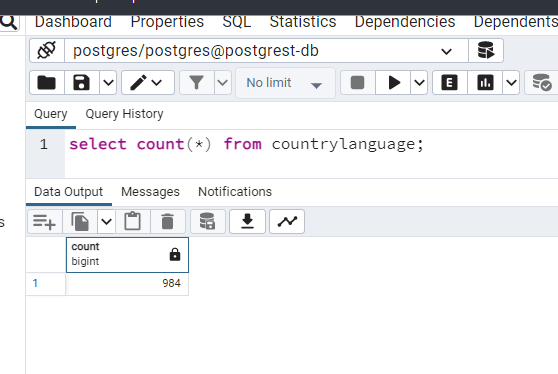

# Count number of items in a resource

> [https://developer.mozilla.org/en-US/docs/Web/HTTP/Headers/Content-Range](https://developer.mozilla.org/en-US/docs/Web/HTTP/Headers/Content-Range)

`HEAD` can be used against a resource to get the total number of records; f.i. to be able to use a navigation bar.

So, don't create an endpoint like `http://localhost:3000/countrylanguage/count` when the standard way is using `HEAD`.

Imagine a database table called `countrylanguage` having `984` records. 



This info can be retrieved like this:

```bash
❯ curl --head http://localhost:3000/countrylanguage
HTTP/1.1 200 OK
Date: Sat, 28 Jan 2023 19:14:45 GMT
Server: postgrest/10.1.1
Content-Range: 0-983/*
Content-Location: /countrylanguage
Content-Type: application/json; charset=utf-8
```

`curl --head` (similar to `curl -i`) is using the `HEAD` HTTP verb.

In order to extract this information in javascript, the [parse-content-range-header](https://github.com/academia-de-codigo/parse-content-range-header/blob/master/index.js) script can perhaps be used.
