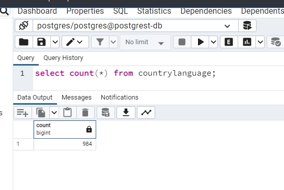

<!-- This file has been generated by the concat.sh script. -->
<!-- Don't modify this file manually (you'll loose your changes) -->
<!-- but run the tool once more -->
<!-- Last refresh date: Monday, October 16, 2023, 13:56:16 -->

# API REST - How to write good APIs


<!-- table-of-contents - start -->
* [Concepts](#concepts)
  * [Resources](#resources)
    * [Don't use verbs in URLs](#don-t-use-verbs-in-urls)
    * [Prefer plural noun](#prefer-plural-noun)
    * [Send the HTTP Accept header](#send-the-http-accept-header)
  * [Responses](#responses)
  * [200 OK](#200-ok)
  * [201 Created](#201-created)
  * [202 Accepted](#202-accepted)
  * [204 No Content](#204-no-content)
  * [400 Not Found](#400-not-found)
  * [403 Forbidden](#403-forbidden)
  * [404 Not Found](#404-not-found)
  * [409 Conflict](#409-conflict)
  * [HEAD](#head)
    * [Count number of items in a resource](#count-number-of-items-in-a-resource)
  * [GET](#get)
  * [POST](#post)
  * [PUT](#put)
  * [PATCH](#patch)
  * [DELETE](#delete)
* [Returned structure](#returned-structure)
  * [Top Level](#top-level)
  * [Data](#data)
  * [Returning an error](#returning-an-error) 
* [Some lectures](#some-lectures)<!-- table-of-contents - end -->

## Concepts

### Resources

#### Don't use verbs in URLs

HTTP has verbs like `GET`, `POST`, `DELETE`, ... so don't use calls like:

* `/articles/gettitle`,
* `/articles/insert`,
* `/articles/1/delete`

But use the adequate HTTP verb:

* `GET /articles/title`,
* `PUT /articles`,
* `DELETE /articles/1`

#### Prefer plural noun

Always use the plural like `GET /employees/1` to return the first employee and not `GET /employee/1`.

Using the plural make it easier to understand that `employees` is a collection and we can use verbs like `GET` to get all, one or a range, `POST` to add a new employee, `PUT` to update a employee's information.

#### Send the HTTP Accept header

It's **really recommended** to inform the server about what you expect for: json, csv, plain-text, xml, ...  To do this, use the `Accept` header like in the example here above. This is safer because the server can change his default format from JSON to CSV f.i. and if you expect JSON, your code will be broken.

Don't do this:

```javascript
const employee = axios.create({
    baseURL: 'http://localhost:3000/employees/123'
})
```

But well:

```javascript
const employee = axios.create({
    baseURL: 'http://localhost:3000/employees/123',
    headers: {
      'Accept': 'application/json'
    }
})
```

Now, in the second example, you are pretty sure `employee` contains json.

### Responses

### 200 OK

A server MUST respond to a successful request to fetch an individual resource or resource collection with a `200 OK` response.

When `DELETE` was used, we can also return `204 No Content` to inform the calling application that deletion was successful.

### 201 Created

If the requested resource has been created successfully and the server changes the resource in any way (for example, by assigning an id), the server MUST return a `201 Created` response and the new added resource in body.

### 202 Accepted

If a request to create/update or delete a resource has been accepted for processing, but the processing has not been completed by the time the server responds, the server MUST return a `202 Accepted` status code.

### 204 No Content

If the requested resource has been created successfully and the server does not change the resource in any way (for example, by assigning an id or `createdAt` attribute), the server MUST return either a `201 Created` status code and the resource in response or a `204 No Content` status code with no response document.

If the deletion was done successfully, `204 No Content` can be used too.

For an update, it's the same: we can send code `200 OK` with the updated resource in the body or, code `204 No Content` without body; just headers.

### 400 Not Found

You should return a `400 Bad Request` response when the call was incorrect like an unknown value is used for a parameter (like `&lang=it` when Italian isn't supported).

### 403 Forbidden

A server MUST return `403 Forbidden` in response to an unsupported request to, for instance, create a resource (with `POST` verb with a client-generated `ID` since the `ID` has to be generated by the server, not the client).

### 404 Not Found

A server MUST respond with `404 Not Found` when processing a request to fetch a single resource that does not exist, except when the request warrants a 200 OK response with null as the primary data (as described above).

### 409 Conflict

A server MUST return `409 Conflict` when processing a `POST` request to create a resource with a client-generated `ID` that already exists.

A server MUST return `409 Conflict` when processing a `POST` request in which the resource object's type is not among the type(s) that constitute the collection represented by the endpoint.

### HEAD

`HEAD` has to be used to retrieve information's about the resource like f.i. the number of records in the resource (number of books, articles, ...) or to check if a resource exists.

For instance, imagine a resource called `countrylanguage`, we can verify if there are records for `countrycode=BEL`:

```bash
❯ curl --head http://localhost:3000/countrylanguage\?countrycode\=eq.BEL
HTTP/1.1 200 OK
Date: Sat, 28 Jan 2023 20:17:08 GMT
Server: postgrest/10.1.1
Content-Range: 0-5/*
Content-Location: /countrylanguage?countrycode=eq.BEL
Content-Type: application/json; charset=utf-8
```

If we get a HTTP return code `200`, we can run a `GET` action to get records:

```bash
❯ curl http://localhost:3000/countrylanguage\?countrycode\=eq.BEL | jq
```

`HEAD` can thus be used to get meta data about a resource.

#### Count number of items in a resource

> [https://developer.mozilla.org/en-US/docs/Web/HTTP/Headers/Content-Range](https://developer.mozilla.org/en-US/docs/Web/HTTP/Headers/Content-Range)

`HEAD` can be used against a resource to get the total number of records; f.i. to be able to use a navigation bar.

So, don't create an endpoint like `http://localhost:3000/countrylanguage/count` when the standard way is using `HEAD`.

Imagine a database table called `countrylanguage` having `984` records. 



This info can be retrieved like this:

```bash
❯ curl --head http://localhost:3000/countrylanguage
HTTP/1.1 200 OK
Date: Sat, 28 Jan 2023 19:14:45 GMT
Server: postgrest/10.1.1
Content-Range: 0-983/*
Content-Location: /countrylanguage
Content-Type: application/json; charset=utf-8
```

`curl --head` (similar to `curl -i`) is using the `HEAD` HTTP verb.

In order to extract this information in javascript, the [parse-content-range-header](https://github.com/academia-de-codigo/parse-content-range-header/blob/master/index.js) script can perhaps be used.

### GET

Return a resource (can be a collection or just one).

Return all employees:

```bash
curl -X GET http://localhost:3000/employees
   -H "Accept: application/json" 
```

Return the employee #1:

```bash
curl -X GET http://localhost:3000/employees/1
   -H "Accept: application/json" 
```

### POST

**Means `CREATE` in `CRUD`**

Using `POST` you'll create a new resource. Calling `POST` five times for the same "new" employee will thus create five new employees. `POST` is **not** idempotent meaning calling it more than once will return every time a new resource (like the new employee id)

```bash
curl -X POST http://localhost:3000/employees
   -d '{"firstname":"christophe",...}'
```

The example here above will create a new employee, the server will return the HTTP status code `201` (CREATED) and, probably, also return a location-header with a link, like `http://localhost:3000/employees/999` i.e. the link to the newly created employee.

### PUT

**Means `UPDATE` in `CRUD`, when you'll update every fields**  

Using `PUT` you'll update an existing resource.

```bash
curl -X PUT http://localhost:3000/articles/15
     -d '{"title":"Introduction to API", "author":"John"}'
```

Consider using `PUT` only when you'll update every information's of the resource. If you wish to update just a few ones (partial content), Consider using `PATCH`.

`PUT` is idempotent since running the same update won't have other effects on the server. You can update once, five or one thousand times the title of the article #15, the result will always be the same.

If successfully updated will return the HTTP status code `200` (OK) or `204` (No Content) if nothing is updated. If successfully created will return the HTTP status code `201` (CREATED) (like when using the `POST` verb).

Note: depending on the API developer, updating an inexisting resource can return an error ('Resource #15 do not exist') or the developer can decide to create it (and thus do the same thing as the `PUT` verb). This is indeed possible since `PUT` is used for full content: you've sent to the server every possible field so it's possible to create it.

### PATCH

**Means `UPDATE` in `CRUD`, when you'll update just a few fields**  

See `PUT` when you'll update the entire resource.

`PATCH` is to be used when the update is partial like updating, just, one column: `curl -X PATCH http://localhost:3000/employee/1 -d '{"firstname": "Christophe"}'` will, only, update first name.

If successfully updated will return the HTTP status code `200` (OK) or `204` (No Content) if nothing is updated. If successfully created will return the HTTP status code `201` (CREATED) (like when using the `POST` verb).

`PATCH` on an inexisting resource will return an error while, perhaps, `PUT` will create the resource. If's then safer to use `PATCH` and not `PUT` when updating partial content.  

It's indeed impossible to create a new record with `PATCH` since the request just mention a few information's, not all.

### DELETE

Remove an inexisting resource

To remove employee #59:

```bash
curl -X DELETE http://localhost:3000/employees/59
```

## Returned structure

### Top Level

> [https://jsonapi.org/format/#document-top-level](https://jsonapi.org/format/#document-top-level)

A document MUST contain at least one of the following top-level members:

* `data`: the document's *primary data*.
* `errors`: an array of error objects.
* `meta`: a meta object that contains non-standard meta-information.

But never both `data` and `errors`

The document's *primary data* is a representation of the resource or collection of resources targeted by a request. 

`data` can be an array or not:

```json
{
  "data": {
    [
        "key1": "value1",
        "key2": "value2",
        // ...
    ],
    [
        // ...
    ]
  }
}
```

or, if just one record, directly:

```json
{
  "data": {
    "key1": "value1",
    "key2": "value2",
    // ...
  }
}
```

### Data

> [https://jsonapi.org/format/#document-top-level](https://jsonapi.org/format/#document-top-level)

As described in [Top Level items](https://jsonapi.org/format/#document-top-level), the returned information should be put as a top level node called `data`:

Best is to always use the array notation so we can return one or more rows.

```json
'data': [
    [ ... ]
]
```

### Returning an error 

> [https://jsonapi.org/format/#document-top-level](https://jsonapi.org/format/#document-top-level)

> [https://jsonapi.org/format/#error-objects](https://jsonapi.org/format/#error-objects)

As described in [Top Level items](https://jsonapi.org/format/#document-top-level), errors should be put as a top level node and use the plural form:

```json
"errors": [
    [ ... ]
]
```

Prefer to use HTTP status code `400 Bad Request` when the call was incorrect like an unknown value is used for a parameter (like `&lang=it` when Italian isn't supported). Use code `500 Internal Server Error` when the server has returned an error.

`errors` has to be an array so we can return more than once and should contain at least one of these keys (*not exhaustive*):

* `status`: the HTTP status code applicable to this problem, expressed as a string value. This SHOULD be provided.
* `code`: an application-specific error code, expressed as a string value.
* `title`: a short, human-readable summary of the problem that SHOULD NOT change from occurrence to occurrence of the problem, except for purposes of localization.
* `parameter`: a string indicating which URI query parameter caused the error.

```json
"errors": [
    [ 
        "status": 400,
        "code": "ERR_INVALID_VIEW",
        "title": "Language code 'it' is not supported",
        "parameter": "lang"
    ],
    [ ... ]
]
```

## Some lectures

* [7 Laravel RESTful APIs best practices for 2023](https://benjamincrozat.com/laravel-restful-api-best-practices)
